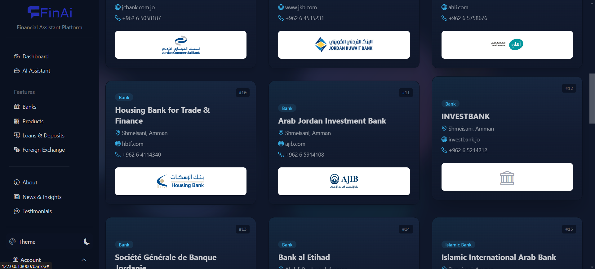
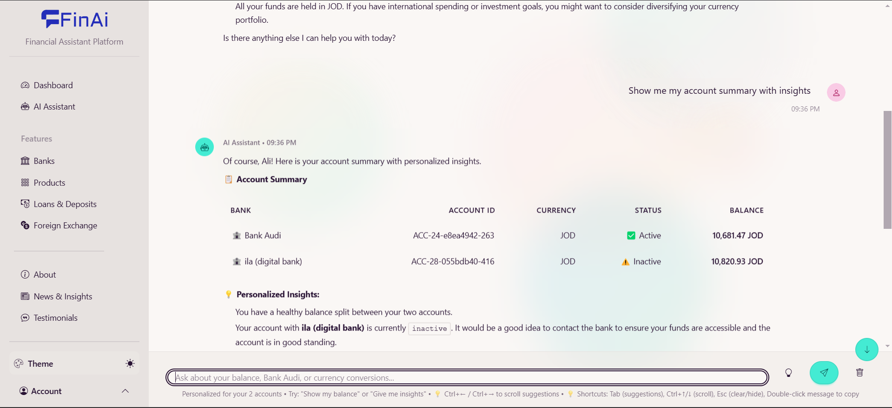
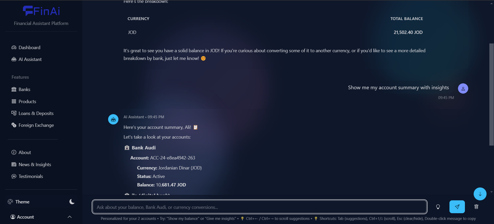
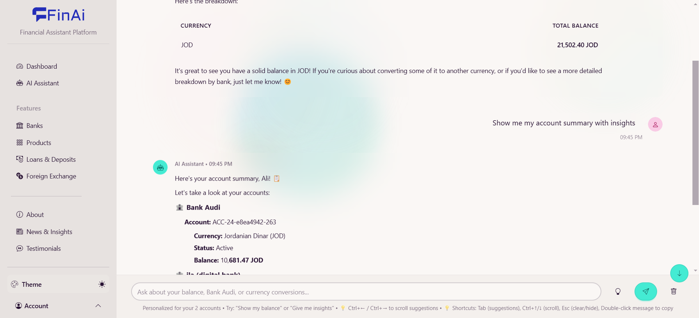
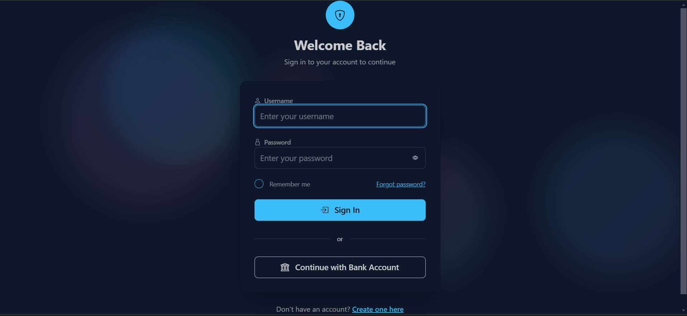
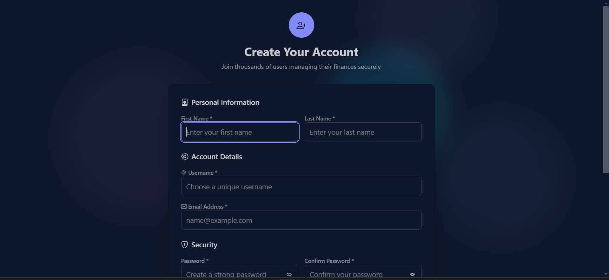

# 🏦 FinAi - Agentic Financial Services Platform

A comprehensive Django-based fintech platform that provides financial product comparison, AI-powered chat assistance, and banking services for Jordanian financial institutions.


## ✨ Features

### 🏠 **Home Dashboard**
- Modern, responsive landing page
- Quick access to all platform features
- Real-time financial data display


### 🏦 **Bank & Institution Management**
- Comprehensive database of Jordanian financial institutions
- Detailed product comparisons
- Fee structures and exchange rates
- Interactive bank selection interface



### 💬 **AI-Powered Chat Assistant**
- Intelligent financial advice
- Product recommendations
- Real-time conversation history
- Context-aware responses





### 🔐 **Secure Authentication**
- User registration and login system
- OTP verification
- Secure session management
- Role-based access control




### ℹ️ **About & Information**
- Platform overview and mission
- Team information
- Contact details


## 🛠️ Technology Stack

### Backend
- **Django 5.2.4** - Web framework
- **Django HTMX** - Dynamic UI interactions
- **Google Generative AI** - AI chat functionality
- **LangChain** - AI/ML integration

### Frontend
- **Tailwind CSS** - Modern styling
- **Django Templates** - Server-side rendering
- **HTMX** - Dynamic content loading

### AI/ML
- **Google Generative AI** - Natural language processing
- **LangChain** - AI workflow management
- **Chat Memory** - Conversation persistence

## 📦 Installation

### Prerequisites
- Python 3.12+
- Node.js (for Tailwind CSS)

### Setup

1. **Clone the repository**
   ```bash
   git clone <repository-url>
   cd MCS
   ```

2. **Create virtual environment**
   ```bash
   python -m venv venv
   source venv/bin/activate  # On Windows: venv\Scripts\activate
   ```

3. **Install dependencies**
   ```bash
   pip install -r req.txt
   ```

4. **Install Tailwind CSS**
   ```bash
   cd fintech
   python manage.py tailwind start
   ```

5. **Run migrations**
   ```bash
   cd fintech
   python manage.py migrate
   ```

6. **Create superuser (optional)**
   ```bash
   python manage.py createsuperuser
   ```

7. **Run development server**
   ```bash
   python manage.py runserver
   ```

8. **Access the application**
   - Open http://127.0.0.1:8000

## 🏗️ Project Structure

```
MCS/
├── fintech/                 # Django project
│   ├── Auth/               # Authentication app
│   ├── backend/            # Core business logic
│   │   ├── models.py       # Database models
│   │   ├── services/       # Business services
│   │   └── management/     # Custom commands
│   ├── fintech/            # Project settings
│   ├── templates/          # HTML templates
│   └── static/             # Static files
├── images/                 # Screenshots and assets
└── req.txt                # Python dependencies
```

## 🗄️ Database Models

### Core Entities
- **FinancialInstitution** - Banks and financial institutions
- **FinancialProduct** - Banking products and services
- **Accounts** - User account management
- **FXRate** - Foreign exchange rates
- **Fee** - Fee structures and charges
- **ChatMemory** - AI conversation history

### Features
- Multi-currency support
- Real-time exchange rates
- Comprehensive fee tracking
- User account management
- AI conversation persistence

## 🤖 AI Features

### Chat Assistant
- **Natural Language Processing** - Understands financial queries
- **Product Recommendations** - Suggests relevant financial products
- **Fee Comparisons** - Compares costs across institutions
- **Exchange Rate Information** - Provides current rates
- **Conversation Memory** - Maintains context across sessions

### Integration
- **Google Generative AI** - Advanced language model
- **LangChain** - AI workflow orchestration
- **Real-time Processing** - Instant responses
- **Context Awareness** - Personalized interactions

## 🔧 Development

### Custom Management Commands
```bash
# Populate database with sample data
python manage.py populate_db
```

### Environment Variables
Create a `.env` file in the `fintech` directory:
```env
SECRET_KEY=your-secret-key
DEBUG=True
GOOGLE_API_KEY=your-google-ai-key
```

## 🚀 Deployment

### Production Checklist
- [ ] Set `DEBUG=False`
- [ ] Configure production database (PostgreSQL recommended)
- [ ] Set up static file serving
- [ ] Configure HTTPS
- [ ] Set environment variables
- [ ] Run `python manage.py collectstatic`


## 📊 API Endpoints

### Authentication
- `POST /auth/login/` - User login
- `POST /auth/signup/` - User registration
- `POST /auth/otp/` - OTP verification

### Financial Data
- `GET /api/institutions/` - List financial institutions
- `GET /api/products/` - List financial products
- `GET /api/rates/` - Get exchange rates
- `GET /api/fees/` - Get fee structures

### Chat API
- `POST /api/chat/` - Send message to AI assistant
- `GET /api/chat/history/` - Get conversation history

## 🤝 Contributing

1. Fork the repository
2. Create a feature branch (`git checkout -b feature/amazing-feature`)
3. Commit your changes (`git commit -m 'Add amazing feature'`)
4. Push to the branch (`git push origin feature/amazing-feature`)
5. Open a Pull Request
